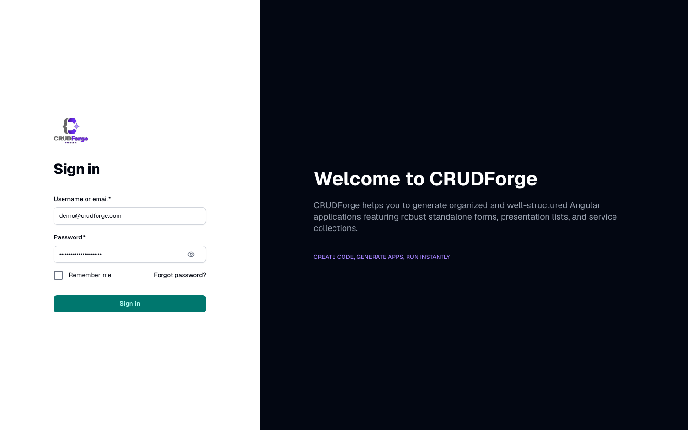

## Primary color

```yaml
fuse:
  theme:
    scheme: system   # or light | dark
    primary: "#791EFF"
    error: "#dc2626"
```

Wired through root `fuseTheme` in `app.ts` + `provideTheming`. **Do not** hardcode primary colors in entity templates.



## Logos

| Asset | Path | Used on |
|-------|------|---------|
| Wordmark | `public/images/logo/logo.png` | Sidebar, sign-in, welcome |
| Mark | `public/images/logo/logo-mark.png` | Favicon, user chip |

Transparent PNGs (no black plate). Docs site reuses the same brand files.

## Clean shell

```yaml
fuse:
  cleanLayout: true
  includePrebuilt: false
```

Strips Fuse demo apps, documentation demos, and promo chrome so the generated app is CRUDForge-shaped.

More: [Branding guide](/guides/branding/).
