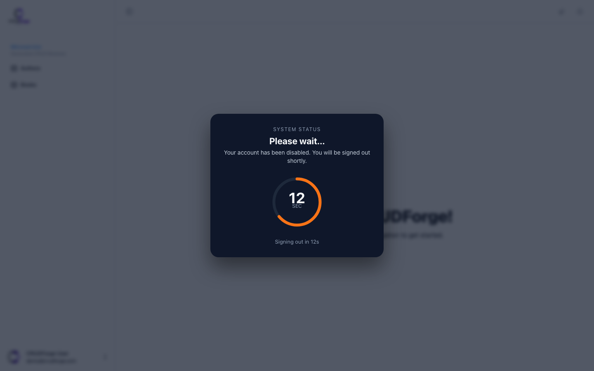

## Sign-in


Generated Fuse sign-in uses CRUDForge branding. Prefill comes from `auth.signInPrefill` or Keycloak admin env refs for live QA.

## Session (default: stay signed in)

```yaml
auth:
  session:
    idleTimeoutMs: 0        # 0 = no idle logout
    crossTabSync: true
    refreshOnFocus: true
```

Resilient refresh keeps the session on network/5xx; only terminal auth errors clear tokens.

Full guide: [Session & disabled account](/guides/session/).

## Disabled-account overlay



When `auth.disabledAccount.enabled: true`, an explicit Keycloak “account disabled” grant freezes the shell and counts down to sign-out.

## Theme on auth chrome

Primary buttons follow root `fuseTheme` (brand violet `#791EFF`) — see [Theme & branding](/customization/theme-branding/).
