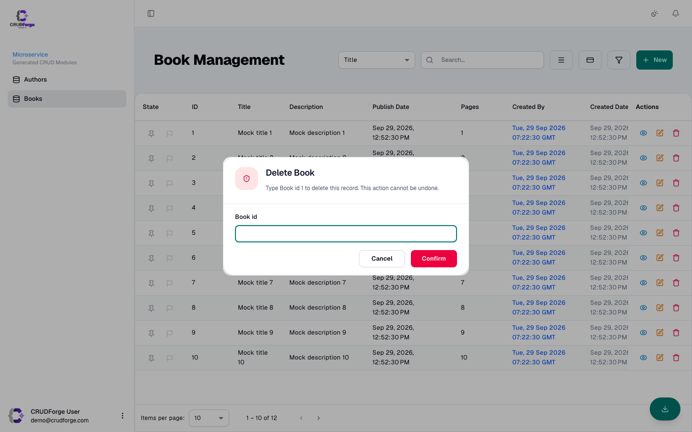

Every entity module is generated under a responsibility-based layout: presentation (list/card/detail), forms, interaction (actions/filter), and service.

## List

Includes:

- Server-driven pagination (mock or real API)
- Field search (`title.contains`-style) when `ui.searchMode: field`
- Pin / flag / export affordances on the list chrome
- ACL stamps (`data-screen-id`, `accessCtrl`) when Keycloak IAM is on

## Create & edit (same formMode)

| `ui.formMode` | New | Edit |
|---------------|-----|------|
| `sidebar` | Opens list drawer | Opens same drawer |
| `page` | Routes to `…/new` | Routes to `…/:id/edit` |

Never leave edit on a full page while new uses the sidebar.

## Filters

Advanced filter panel per entity — operators depend on field types.

## Card view

Toggle when `ui.viewMode` / list chrome allows card layout. Grid breakpoints via `ui.gridCols` and `ui.cardBreakpointPx`.

## Detail

Read-only property sheet with relationship links when JDL relationships are generated.

## Delete

Shared confirmation (and typed-confirm for destructive IAM/entity deletes) under `apps/shared/`.

## Related customization

See [UI modes](/customization/ui-modes/) and [generate toggles](/customization/generate-toggles/).
