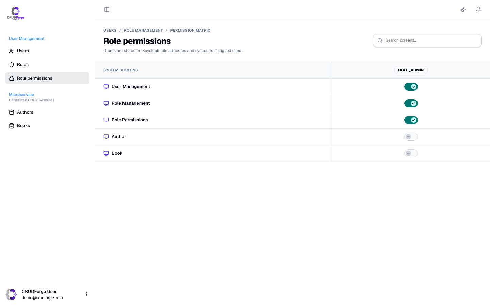

IAM is an **overlay** on Keycloak — not JDL entities. Enable with `auth.provider: keycloak` and `iam.enabled: true`. Do **not** model `User` or `Role` in your JDL.

Generated UI lives under `src/app/core/user-management/` with a sidebar group labeled **User Management**.

## Screens at a glance

| Screen | Route | Purpose |
|--------|-------|---------|
| Users | `/admin/user-management` | List, create, edit, delete, change password |
| Roles | `/admin/user-management/roles` | Create roles, assign users |
| Role permissions | `/admin/user-management/role-permissions` | Screen ACL matrix per role |
| User → roles | `/admin/user-management/:id/access` | Which roles a user holds |
| User → screens | `/admin/user-management/:id/permissions` | Per-user screen/component overrides |
| User detail | `/admin/user-management/:id/view` | Read-only profile |

Toggles: `iam.roles`, `iam.rolePermissions`, `iam.userAccess`, `iam.userPermissions` (all default `true`).

## Users


- Table / card list with search
- **New** opens a drawer (create username, email, names, temporary password)
- Row actions: view, edit, change password, assign roles, assign screens, delete
- Each control is stamped with `data-screen-id="user-management"` + `data-component-id` and gated by the `accessCtrl` pipe

## Roles


Master–detail role management:

- Create realm-style roles (e.g. `ROLE_ADMIN`, `ROLE_OFFICER`)
- Assign / unassign users
- Role metadata attributes (description, etc.) when the Admin Service supports them

Nav label: **Roles** under User Management.

## Screen access (permission matrices)

CRUDForge ACL is **attribute-based**: Keycloak role/user attributes encode which screens (and optional components) a principal may open. Matrices write those attributes; the runtime reads them.

### Role → screens



`/admin/user-management/role-permissions`

- Rows = managed screens (from admin navigation + `iam.screens` extras + IAM itself)
- Columns = roles (e.g. `ROLE_ADMIN`)
- Toggle grants screen access on that role’s attributes

Admins listed in `environment.adminRoles` bypass ACL checks (full access).

### User → roles / user → screens

From the users list:

| Action | Route | Writes |
|--------|-------|--------|
| Assign Role Matrix | `…/:id/access` | User’s role membership |
| Assign User Matrix | `…/:id/permissions` | Per-user screen/component grants |

User-level permissions override or supplement role-derived grants depending on how attributes merge in `AccessControlService`.

## How access is enforced in the app

```text
Sign-in → token roles + attributes
       → AccessControlService loads / merges attributes
       → Sidebar filters nav items the user cannot open
       → LandingGuard → first allowed screen (or /admin/no-access)
       → Buttons/menus use *ngIf="SCREEN | accessCtrl: 'edit'"
```

- **Screen id** — usually the entity kebab name (`book`, `author`) or IAM ids (`user-management`, `role-management`, `role-permissions`)
- **Component id** — fine-grained (`new`, `edit`, `delete`, `view`, `filter`, …)
- Stamps on generated entity chrome: `data-screen-id` / `data-component-id`

**Important:** hiding UI is not authorization. Protect APIs on the server; ACL only shapes the admin shell.

## Config

```yaml
auth:
  provider: keycloak
  useMockAuth: true          # mock IAM for local QA
  # useMockAuth: false       # live Admin Service gateway
iam:
  enabled: true
  roles: true
  rolePermissions: true
  userAccess: true
  userPermissions: true
  screens: []                # optional extra screen ids beyond nav
```

## Related

- Step-by-step: [Users, roles & screen access](/guides/iam-access/)
- Keycloak bootstrap & secrets: [Keycloak & IAM](/guides/auth-keycloak/)
- Session / disabled account: [Session](/guides/session/)
