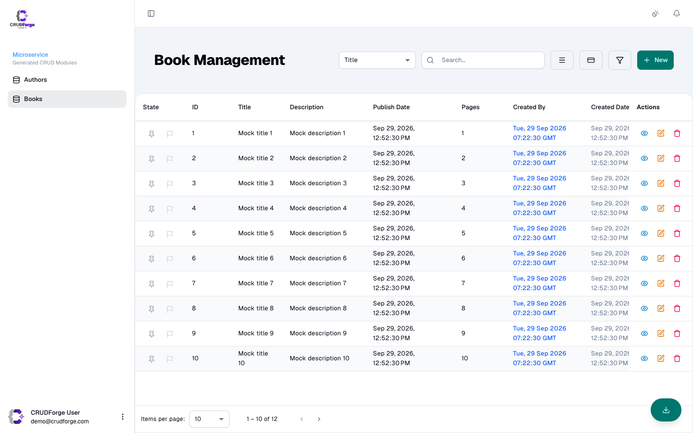
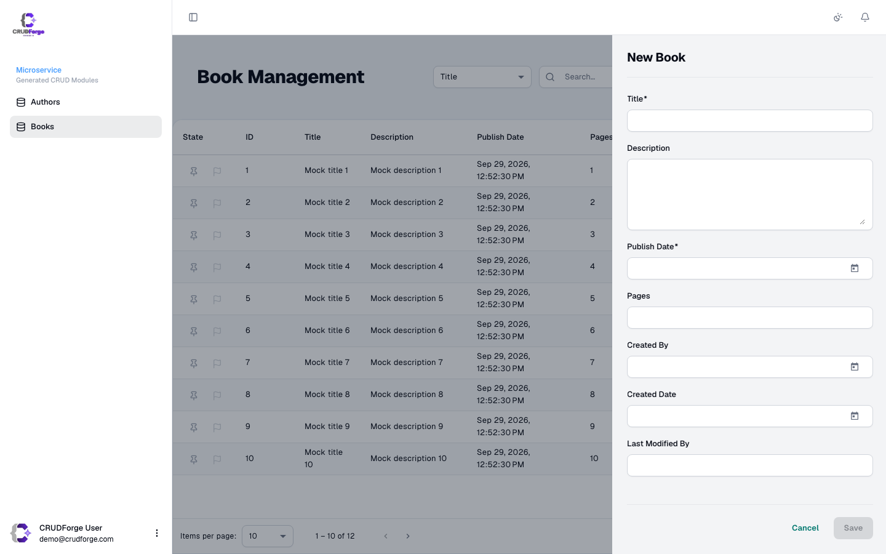
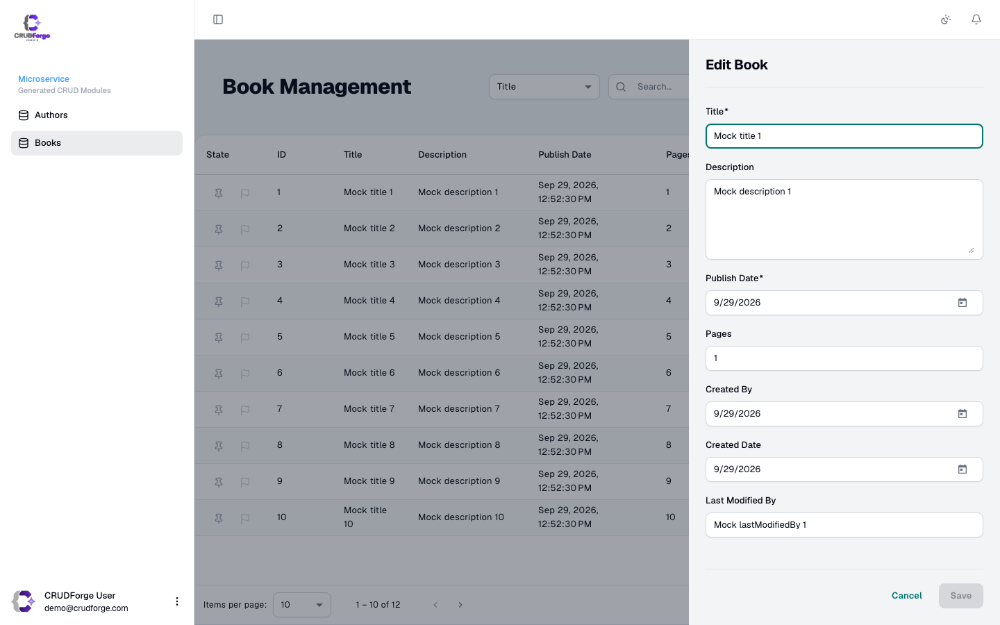
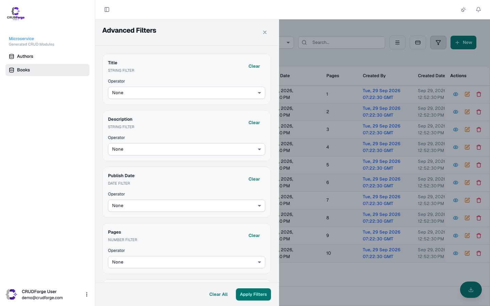
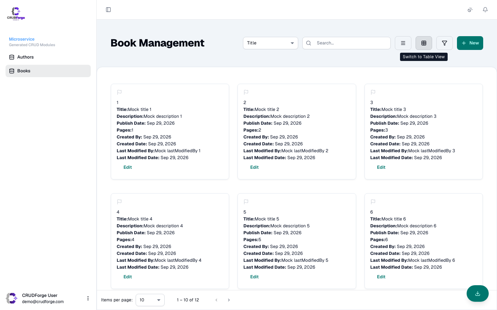
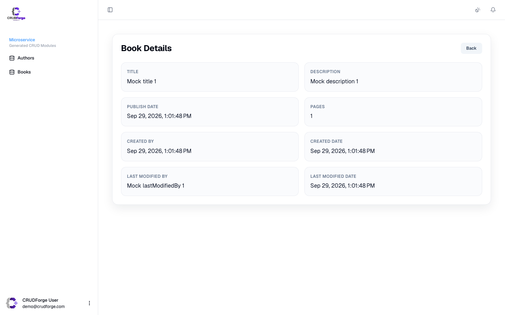
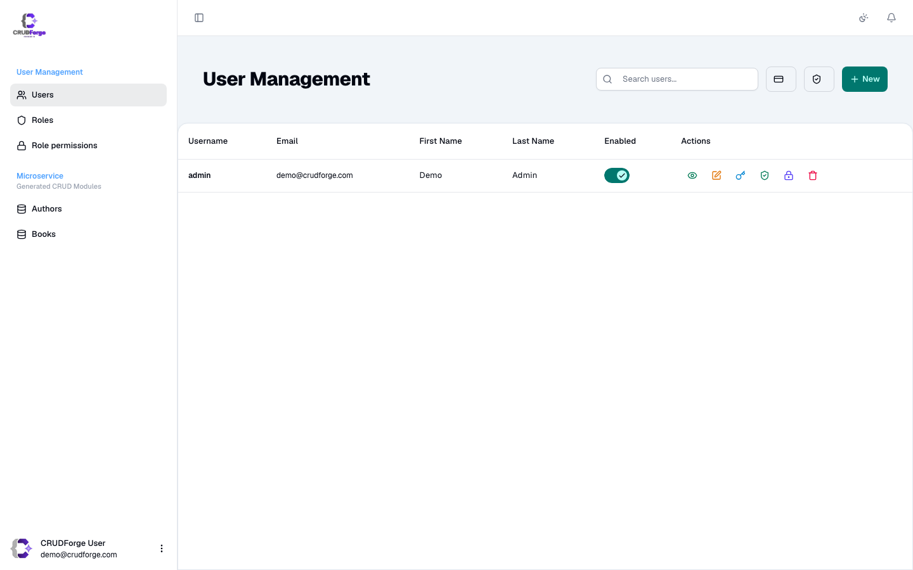
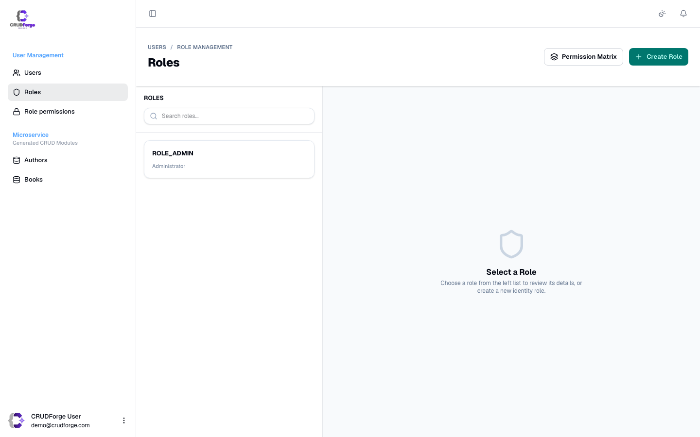

CRUDForge turns a JDL domain into a Fuse admin app: entity CRUD, optional Keycloak auth, and an IAM overlay. Below is the product surface you’ll ship — not Fuse demo chrome.

## At a glance

| Area | What you get |
|------|----------------|
| Entity CRUD | List, card, form (sidebar or page), detail, filter, actions |
| Search | Field `contains` by default (`ui.searchMode: field`) |
| Auth | Optional Keycloak pack — mock or live |
| IAM | Users, roles, matrices, ACL-filtered nav |
| Session | Stay signed in by default; optional disabled-account overlay |
| Branding | Root `fuseTheme` / `#791EFF` violet |

## Gallery

### Sign-in

Clean split layout: wordmark + credentials on the left, welcome copy on the right. No social login or Fuse demo banners.

### Entity list

Paginated table, field search, New / filter / export / pin / flag actions.

### Sidebar form (new & edit)

`ui.formMode: sidebar` — **new and edit share the same drawer**. Page mode routes both to full pages instead.

### Filters

### Card view

### Detail

### User Management (IAM)

## Dig deeper

- [Entity CRUD](/features/entity-crud/)
- [IAM overlay](/features/iam/)
- [Auth UX](/features/auth-ux/)
- [UI modes customization](/customization/ui-modes/)
